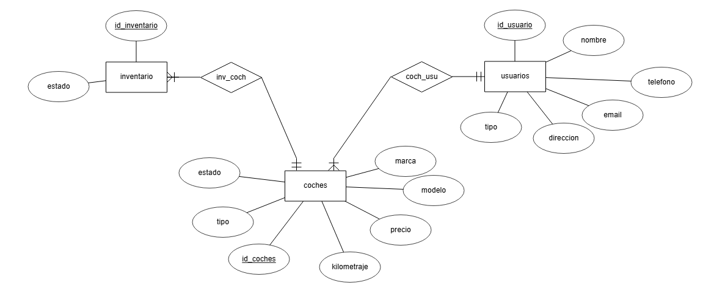
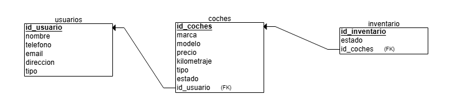

# Proyecto de Gestión de Compra y Venta de Coches


Este proyecto es una aplicación de gestión de compra y venta de coches utilizando Java y una base de datos MySQL. La base de datos está estructurada en tres tablas: **Coches**, **Inventario** y **Usuarios**. El sistema permite realizar diversas operaciones como crear, actualizar, eliminar, exportar e importar a csv y visualizar registros de coches, inventario y usuarios.

## Requisitos Previos

Para poder ejecutar este proyecto, necesitas tener los siguientes requisitos instalados en tu máquina:

- **XAMPP**: Para ejecutar el servidor de base de datos MySQL.
- **JDK (Java Development Kit)**: Para compilar y ejecutar el código Java.
- **(Opcional) Visual Studio Code**: Como editor de código (aunque puedes usar el editor de tu preferencia).

## Instalación

Debemos realizar un git clone del repositorio para acceder a todas las funciones del programa, ademas de configurar la base de datos.

### Clonar el Repositorio

```bash
git clone https://github.com/SamuelMarquezRuiz/Trabajo-BBDD-Java-SamuelMarquezRuiz.git
```

### Configurar la Base de Datos

En el navegador, se abrirá la interfaz de phpMyAdmin. En la barra superior de opciones, haz clic en importar. Selecciona el archivo Compra-Venta-BBDD.sql y, al final de la página, haz clic en importar para cargar la estructura de la base de datos.

## Diagrama Entidad-Relación de la BBDD
 

## Diagrama Relacional de la BBDD
 

## Operaciones del Programa
El programa de  Java habilita la ejecución de múltiples operaciones en tablas de bases de datos.

- **Crear**: permite insertar nuevos registros en cualquiera de las tres tablas.

- **Modificar**: permite la modificación de los datos existentes en cualquier fila dentro de las tablas

- **Eliminar**: autoriza la eliminación de registros particulares de las tablas según sea necesario.

- **Listar todo**: Ver todas las filas en las tablas

- **Buscar por ID**: Esta función permite buscar entradas particulares por su ID de identificador única dentro de cada tabla

## Conclusión
El Programa permite la gestión eficiente de compra y venta de coches mientras se mantiene íntegra a través de relaciones entre tablas, eficiente y pudiendo realizar varias acciones para manipular los datos.